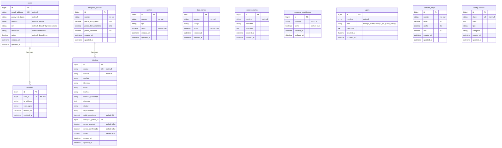

# Database Diagram — Compras Express Cargo

> Auto-generated from `db/schema.rb` (version `2026_03_31_051755`)

## Relationships

| Parent | Child | Type | FK | Notes |
|--------|-------|------|----|-------|
| `users` | `sessions` | 1:N | `user_id` | `dependent: :destroy` |
| `categoria_precios` | `clientes` | 1:N | `categoria_precio_id` | optional |

## Standalone Tables (no FK relationships yet)

These are catalog/lookup tables that will be referenced by future transactional tables (paquetes, manifiestos, facturas, etc.):

- **carriers** — shipping carriers (aereo, maritimo)
- **tipo_envios** — shipment types (AEREO, AEREO EXPRESS, MARITIMO)
- **consignatarios** — consignees for customs
- **empresa_manifiestos** — manifest companies
- **lugars** — warehouses and delivery points (enum: bodega_miami, bodega_hn, punto_entrega)
- **tamano_cajas** — box size presets (largo x ancho x alto)
- **configuracions** — key-value system settings

## User Roles

| Role | Description |
|------|-------------|
| `admin` | Full system access |
| `supervisor_miami` | Miami warehouse supervisor |
| `digitador_miami` | Miami data entry |
| `supervisor_caja` | Cashier supervisor |
| `supervisor_prefactura` | Pre-invoice supervisor |
| `cajero` | Cashier |
| `sac` | Customer service |
| `entrega_despacho` | Delivery/dispatch |
